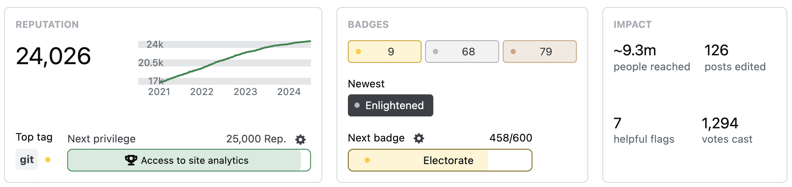

<p align="center">

</p>

<div align="center">


</div>

---

## Overview

[Live Deployment of this repo](https://sajibkhan.com)

## Getting Started

Fork/clone this repo

Go to the folder you cloned, run the development server:

```bash
npm install
npm run dev
```

Open [http://localhost:3000](http://localhost:3000) with your browser to see the result.

You can start editing the sections in the resume by modifying files in `components/section` folder. And change the your photo in the navbar by change the file `/components/header.tsx` and `public/images/portrait.jpeg`.
